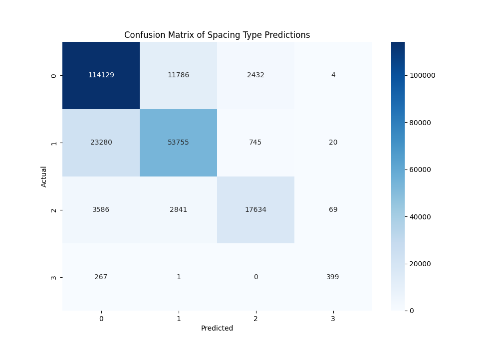

# Java Code Token Spacing Prediction

This project trains a small Transformer-based neural network to predict token spacing between two tokens in Java code. The task is inspired by the paper [Learning to Format Coq Code Using Language Models](https://arxiv.org/abs/2006.16743v1) and applied to the Java subset of the [CodeSearchNet dataset](https://github.com/github/CodeSearchNet).

The project focuses on determining the appropriate spacing between tokens based on both the tokens themselves and their types (e.g., keywords, operators, identifiers).

The model is designed to predict the spacing between two consecutive tokens in Java code. Each token is categorized by its type, such as keywords, annotations, identifiers, operators, punctuation, literals, and whitespace, using regular expressions. This token information is used to predict how the tokens should be spaced.

## Dataset

### Source

The dataset used for this project is the Java subset from the [CodeSearchNet dataset](https://huggingface.co/datasets/code-search-net/code_search_net/tree/main), which contains a diverse collection of Java code snippets sourced from various open-source repositories on GitHub. This dataset provides a rich resource for training and evaluating machine learning models on programming tasks.

### Preprocessing

Before using the dataset for training, the Java code snippets are preprocessed as follows:

1. **Formatting**: A custom function called `create_datasets` is implemented to format the Java code using [Google Java Format](https://github.com/google/google-java-format). This function ensures consistent styling and structure across the code snippets, removing formatting inconsistencies and adhering to standard Java conventions.

2. **Data Loading**: The formatted Java code is loaded into the project using custom preprocessing functions. The raw data is stored in JSON Lines format (JSONL), where each line represents a single Java code snippet.

3. **Tokenization**: Each code snippet is tokenized into individual components (tokens) using regular expressions that define various token patterns, including:
   - Keywords (e.g., `public`, `class`, `return`)
   - Annotations (e.g., `@Override`, `@Test`)
   - Identifiers (e.g., variable and method names)
   - Operators (e.g., `+`, `-`, `*`, `=`)
   - Punctuation (e.g., `{`, `}`, `;`, `,`)
   - Literals (e.g., numeric values)

   The tokenization process helps in identifying the type of each token, which is crucial for predicting spacing between tokens.

### Dataset Splits

The dataset is divided into two main parts (80/20):
- **Training Set**: Contains the majority of the data, used to train the model. It is prepared by applying the formatting process and filtering out empty or unchanged code snippets.
- **Validation Set**: A smaller portion of the dataset used to test the model's performance.

## Results

The performance of the trained Transformer model was evaluated on a total of 10,000 Java code snippets, which includes both the training and validation sets. The model's ability to predict spacing between tokens was measured using top-1 and top-3 accuracy metrics.

### Accuracy Metrics
- **Top-1 Accuracy**: 79.87%
- **Top-3 Accuracy**: 99.89%

These results indicate that the model effectively predicts the correct spacing between consecutive tokens in Java code.

### Confusion Matrix
The confusion matrix below illustrates the model's performance in predicting the various spacing classes. It provides a visual representation of the correct and incorrect predictions made by the model.

<div align="center">
    
</div>

### Spacing Classes

The model categorizes spacing into four classes:
- **No Spacing (0)**: Indicates that there should be no space between tokens.
- **Space (1)**: Indicates that a single space should be inserted between tokens.
- **Newline and Tab (2)**: Indicates that both a newline and a tab character should be inserted.
- **Newline (3)**: Indicates that a newline character should be inserted.

## How to Use

To replicate the results of this project and train your own model, follow the steps below:

### 1. Clone the Repository

Start by cloning this GitHub repository to your local machine:

```bash
git clone https://github.com/Olivera2708/Space-formatting
cd Space-formatting
```

### 2. Install Requirements

Install the necessary Python packages using the `requirements.txt` file included in the project:

```bash
pip install -r requirements.txt
```

### 3. Download the Dataset

Download the Java subset of the [CodeSearchNet dataset](https://github.com/github/CodeSearchNet) from the provided link.

### 4. Prepare the Dataset

You can use the `data.jsonl` file from the repository, which consists of approximately 70,000 formatted Java codes, or generate your own, larger one:

1. Unzip the downloaded dataset.
2. Create a folder named `dataset` in the root directory of your project.
3. Copy the relevant data files from the unzipped dataset into the `dataset` folder. The structure should look like this:

   ```
   project-directory/
   ├── dataset/
   │   ├── train/
   │   │   ├── train0.jsonl
   │   │   ├── train1.jsonl
   │   │   └── ...
   │   ├── valid.jsonl
   │   └── test.jsonl
   ```

4. Uncomment the `create_datasets` function in `main.py` to generate the formatted dataset. This function will apply Google Java Format to ensure consistency in the code snippets.

### 5. Training the Model

You can either use the pre-trained model (`model.pth`) provided in this repository or train your own model from scratch. Based on your choice, uncomment and comment the last lines in `main.py` accordingly.